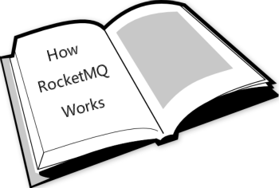

# RocketMQ-Learning

RocketMQ是一个性能很好的消息中间件，他在阿里内部有着广泛的使用。这本书适合于希望理解**RocketMQ设计原理**的读者，建议结合源码一起阅读。 

为什么我们要阅读这本mini书？
* 这本书的目的是为了**弥补官方文档以及源码注释的稀少**。 
* 即使你没有使用过RocketMQ，通过本书你也能很快入门。 
* 通过本书，你可以学习到RocketMQ的设计理念(为什么可以做到如此高效？)。同时，你也能学习到计算机网络，操作系统相关的知识 
* 本书同时提供了带注释的源代码，结合源码理解完本教程你甚至可以进行**二次开发**，定制你自己想要的功能。 

本书结合源码从浅入深的介绍了RocketMQ的使用与设计原理，**运用了大量的图示**，即使是初学者也能很好的理解文章希望表达的意思。 
推荐初学者从第1章开始阅读。broker的设计原理需要重点关注。预计1~2个月时间完成本教程。 

进度如下 
- [x] 【RocketMQ原理解析1.1】整体介绍&IDE编译并启动RocketMQ的第一个例子
- [ ] 【RocketMQ原理解析2.1】源码目录结构介绍&Remoting通信层
- [ ] 【RocketMQ原理解析3.1】NameSrv源码解析
- [ ] 【RocketMQ原理解析4.1】 Producer启动
- [ ] 【RocketMQ原理解析4.2】 Producer发送普通消息&发送端负载均衡
- [ ] 【RocketMQ原理解析4.3】 Producer发送顺序消息
- [ ] 【RocketMQ原理解析5.1】 PushConsumer启动
- [ ] 【RocketMQ原理解析5.2】 PushConsumer并发消费普通消息
- [ ] 【RocketMQ原理解析5.3】 PushConsumer消费顺序消息
- [ ] 【RocketMQ原理解析6.1】 Broker启动
- [ ] 【RocketMQ原理解析6.2】 Broker的消息存储&消息转发
- [ ] 【RocketMQ原理解析7.3】 Broker中的高可用服务HA实现(master + slave)
- [ ] 【RocketMQ原理解析7.4】 Broker中的索引服务Index Service实现

## 文章索引

#### [【RocketMQ原理解析一】整体介绍&IDE编译并启动RocketMQ的第一个例子](book/ch1/1-overview.md)
* 整体介绍
* IDE中启动第一个例子

#### 【RocketMQ原理解析二】整体介绍&IDE编译并启动RocketMQ的第一个例子

