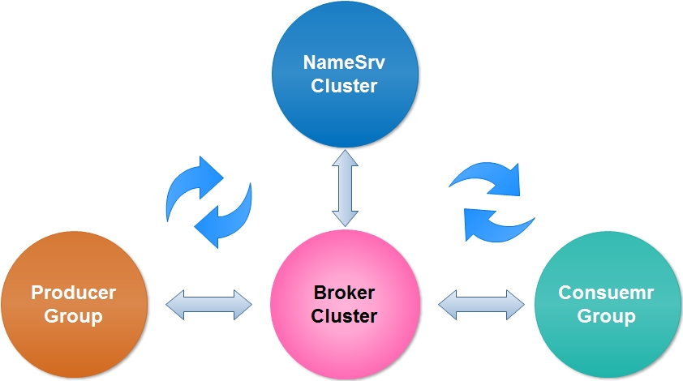
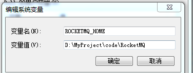
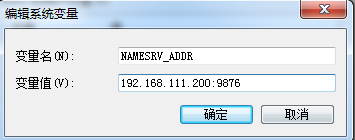
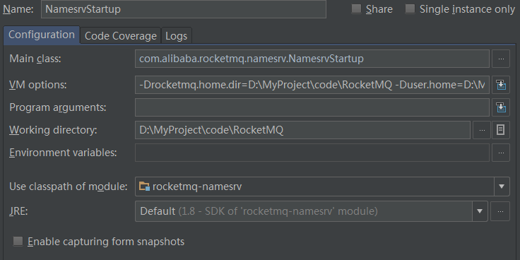
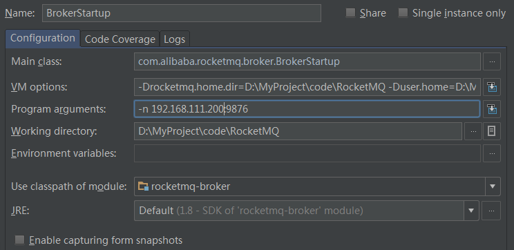
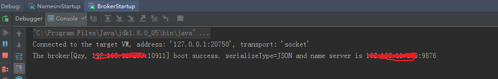
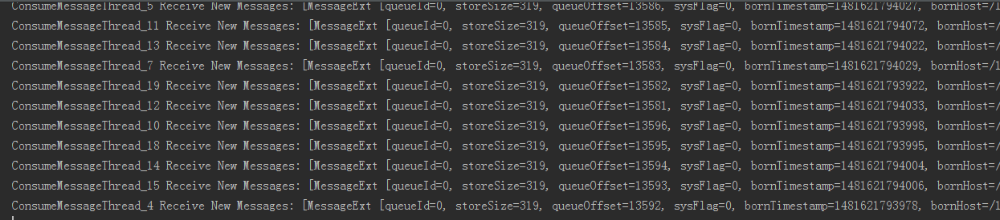

#【RocketMQ原理解析一】整体介绍&IDE编译并启动RocketMQ的第一个例子

------

##一、整体介绍
在RocketMQ里，有以下几个核心的模块：**Producer**，**Consumer**，**Broker**，**NameSrv**。他们之间的关系如下：
 

先简单了解一下各个模块的功能，下面会有章节详细介绍各个模块的功能。

 - Producer和Consumer很好理解，顾名思义就是生产者和消费者，生产者负责生产消息，消费者负责消费消息，这2块的逻辑都是由业务使用者定义的。

 - Broker是RocketMQ的核心，Broker实现了**消息的存储、拉取**等功能。Broker通常以集群方式启动，并可配置主从，每个Broker上提供对指定topic的服务。理解了Broker的原理，以及和其他服务交互的方式就基本弄懂了整个消息中间件的原理。

 - NameSrv是一个无状态的名称服务，可以集群部署。所有Broker启动的时候会向NameSrv注册自己的信息。Producer会根据目标topic从NameSrv获取到达指定Broker的路由信息，Consumer同理。

对于Producer端RocketMQ采用了轮询的方式保证了负载均衡，Consumer端通常采用cluster集群方式消费消息，我们可以自己定义消息在消息端的分配方式。另外，MQ还提供了顺序消息的特性，简单了解一下MQ提供的特性即可，具体实现后面章节会进行阐述。

------
##二、启动第一个例子
 1. 首先从github上将代码**git clone**到本地，之后最好先将代码切到一个稳定的标签或者分支，否则master的代码很可能会编译不过。
	 推荐使用正在apache孵化的版本https://github.com/apache/incubator-rocketmq.git
 
 2. IDEA中File->Open，根据提示以Maven方式导入即可，IDEA会自动下载依赖，可能需要一段时间，然后执行**maven install**当全部提示success即可。
 
 3. 编辑windows环境变量：
 **ROCKETMQ_HOME**就是git clone下来的根目录
 
**NAMESRV_ADDR**端口号固定，ip根据**实际情况**确定(windows控制台输入ipconfig查看) 
 
上面还有一点需要注意的是，设置完环境变量后，最好重启一下电脑，否则消费者和生产者可能找不到namesrv的地址，而无法获取对应topic的路由信息产生"No route info of this topic"。
如果未设置NAMESRV_ADDR，则需要在生产者和消费者的代码里指定名称服务地址：
     >producer.setNamesrvAddr("192.168.111.200:9876");

 4. 启动NameSrv： 
	 (1) 在IDEA的application configuration内配置主类：
     >com.alibaba.rocketmq.namesrv.NamesrvStartup
     
     (2) 根据**实际路径**配置VM option中的环境变量：
     >-Drocketmq.home.dir=D:\MyProject\code\RocketMQ
	    -Duser.home=D:\MyProject\code\RocketMQ\user.home

	上面的user.home指定了MQ的用户目录，里面包括broker存储产生的commitlog文件，日志文件，json配置文件，consumequeue相关信息，简单了解即可。
	 

 5. 启动Broker，Broker的配置与Namesrv类似，但是启动参数需要指定namesrv的地址：
     >-n 192.168.111.200:9876
     
	 或者在VM options指定也可以：
	 >-Drocketmq.home.dir=D:\MyProject\code\RocketMQ
-Duser.home=D:\MyProject\code\RocketMQ\user.home
-Drocketmq.namesrv.addr=192.168.111.200:9876

  
  
  启动成功后将在控制台看到类似这样的提示，若没有请不要往下，请检查配置：
 

 6. 启动consumer，先指定主类：
	>com.alibaba.rocketmq.example.simple.PushConsumer

 注意，有时候会碰到No route info of this topic，先检查namesrv的配置。环境变量设置并重启后，代码不用手动设置，否则需要：
     >producer.setNamesrvAddr("192.168.111.200:9876");

 其他的不需要额外的设置。看到控制台输出consumer started表明启动成功了。

 7. 启动Producer，指定主类：
	 >com.alibaba.rocketmq.example.quickstart.Producer
	 
  这里要注意Producet生产的message topic要和consumer订阅的topic以及tag对应上。
  然后就可以看到控制台源源不断的输出了：
   

